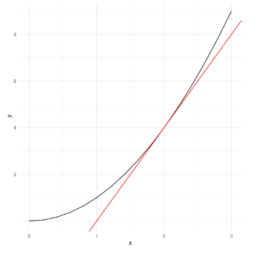
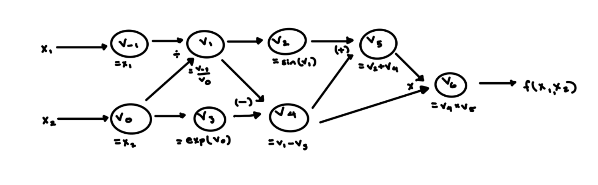

## Introduction

In its simplest form, we define the derivative of a function as its rate of change. We should familiarize ourselves with an example of a function, the notation for a derivative, and the graphical representation of rate of change.

Say we are incredibly lucky in our investments and our return, $f(x)$, is modeled by the function $f(x) = x^2$. Here, $x$ can represent the dollar amount we invest. We would like to measure the rate at which our return, $f(x)$, changes with respect to a change in our investment dollar amount, $x$. The notation for such is represented mathematically as:

$$\frac{df}{dx} =lim_{\Delta x\to 0} \frac{\Delta f}{\Delta x}$$

For example, we may model the relationship between investment ($x$) and returns ($f(x)$) using a function $f:\mathbb{R}\to \mathbb{R}$, by $f(x) = x^2$. 

The derivative is modeled as $2\cdot x$ and we can interpret it as the instantaneous rate of change - slope - as seen in the illustration below. 



While the example above serves as a toy example to familiarize ourselves with the topic of differentiation and its graphical interpretation, the power of the derivative is not to be understated. Its origins date back to Isaac Newton and applications in physics and movement; however, it has since grown with applications in various different branches such as statistics, biology, finance, computer science, and many more fields.

There are three popular methods to calculate derivatives:

1) **Numerical**

2) **Symbolic**

3) **Automatic**

Numerical differentiation is the most basic and general introduction to calculating derivatives. In numerical differentiation we rely on the definition of the derivative, where we measure the amount of change in our function with a very small change in our input (x+h).

$$\frac{\delta{f(x)}}{\delta x} = lim_{h\to 0} \frac{f(x + h) - f(x)}{h}$$

However, numerical differentiation can have issues with round off errors that lead to not achieving machine precision and can struggle with computational time when many dependent variables exist. 

Symbolic differentiation attempts to manipulate formulas to create new formulas rather than performing numerical calculations. In doing so, we can in essence memorize derivatives of functions. However, symbolic interpretation is challenging to implement in computer programs and can be inefficient coding. 

Automatic differentiation focuses on certain core elements: the chain rule, elementary functions and, to a lesser extent, dual numbers. The benefits of automatic differentiation are that it does not suffer from the same round off errors that numerical differentiation is susceptible to and does not suffer from the overly expensive, inefficient methods of symbolic differentiation. For these reasons, automatic differentiation is ubiquitous in tasks requiring quick differentiation, such as optimization in machine learning.


## Background

Automatic differentiation builds off of two fundamental and relatively easy to understand concepts: elementary functions and the chain rule. 

### Elementary Functions

First, we can begin by providing an example of identifying elementary functions within a function. Consider the function: 

$f(x_{1}, x_{2}) = exp( sin(x_{1}^{2} + x_{2}^{2}) + 2 * cos(\frac{x_1}{x_2}))$

In the function above we can identify several functions that would be considered elementary functions: multiplication, division, sin(), cos(), exponentiation, powers. Automatic differentiation breaks about functions such as f(x) into the components of its elementary functions to act on intermediate steps in order to solve for its derivative. A more comprehensive list of elementary functions is included below: 

<br> 

| Category| Elementary Functions |
| --- | --- |
| Arithmetic | multiplication, addition, subtraction, division |
| Powers and Roots | $x^{2}$, $y^{1/2}$ |
| Trigonometric | sine, cosine, tangent, secant, cosecant, cotangent |
| Logarithmic | $\log(x)$ |
| Exponential | $\exp(x)$ |

### Chain Rule 

Utilizing the above elementary functions, automatic differentiation applies the ever important chain rule to the elementary functions in order to solve the derivative of more complex functions. As a quick recap of the chain rule, let us define the following function: 

$f(x) = exp(4x)$

We can replace $4x$ with $u(x)$. This will allow us to do the following differentiation to get our desired derivative of $f(x)$ with respect to $x$. 

$\frac{df}{dx} = \frac{df}{du} \cdot \frac{du}{dx} = exp(u)\cdot 4 = 4\cdot exp(4x)$

### Computational Graph (Forward Mode)

A computational graph allows us to see the ordered sequence of elementary functions, how we break down a more complex function from inside to outside (in forward mode), and how we can calculate intermediate steps to arrive at our final derivative result. 

In the computational graph below, we can see that we begin with the inputs to the function, independent variables denoted by subscripts -1 and 0 (these generally take values < 1). Additionally, we build on these with intermediate variables from $v_0, v_1, ...$. The intermediate variables parallel the elementary functions applied at each step until we arrive at the full complex model from the inside out (again in forward mode). We can follow the computational graph's arrows to see how the elementary functions are applied until we reach our desired result of differentiation.

Let us examine the utility of a computational graph with a complex function such as: 

$f(x_1, x_2) = [sin(\frac{x_1}{x_2} + \frac{x_1}{x_2}) - e^{x_2} ] \cdot [ \frac{x1}{x2} - e^{x_2}]$ 

We can see that elementary functions we will need are exp(), sin(), addition, subtraction, multiplication, and division. Additionally, we will need to create intermediate steps that build on the independent variables $x_1$ and $x_2$ in order to create all parts of the complex model. By following the arrows of the graph, we can see how we can begin at the independent variables and arrive back at the full complex function f(x). 



### Evaluation Trace (Forward Mode)

The evaluation trace allows us to utilize the components of our computational graph to aid us in solving the function value at a specific point and the partial derivatives with respect to each independent variable. The latter is done by utilizing seed vectors, p, which indicate the input variable to calculate the partial derivative of for the function. We will require one pass for each of the independent variables $(x_1, x_2)$. In the first pass, shown below, we set the seed vector $p = [1\;0]$.

| Forward Primal Trace           | Forward Tangent Trace ($p = [1 \; 0 ]$)                    |
| ---                            | ---                                                        |
| $v_{-1} = x_1 = 1.5$           | $D_pv_{-1} = 1$                                            |
| $v_0 = x_2 = 0.5$              | $D_pv_{0} = 0$                                             |
| $v_1 = \frac{v_{-1}}{v_0} = 3$ | $D_pv_1 = \frac{(v_0 D_pv_{-1} - v_{-1}D_pv_0}{v_o^2} = 2$ |
| $v_2 = sin(v_1)$ = 0.141       | $D_pv_2 = cos(v_1) \cdot D_pv_1 = -1.98$                   |
| $v_3 = exp(v_0) = 1.649$       | $D_pv_3 = v_3 \cdot D_pv_0 = 0$                            |
| $v_4 = v_1 - v_3 = 1.351$      | $D_pv_4 = D_pv_1 - D_pv_3 = 2$                             |
| $v_5 = v_2 + v_4 = 1.492$      | $D_pv_5 = D_pv_2 + D_pv_4 = 0.02$                          |
| $v_6 = v_5 \cdot v_4 = 2.017$  | $D_pv_5 \cdot v_4 - D_pv_4 \cdot v_5 = 3.012$              |


We point out that the left column gives us the result of our function $f(x_1 = 1.5, x_2 = 0.5)$. Meanwhile, the right column gives us the results of the partial derivative with respect to $x_1$. We would require another pass with $p =[0 \; 1]$ in order to solve for the partial derivative with respect to $x_2$.


## How to Use AutoDiff

The package will include a module for an `AutoDiff` class that utilizes the core data structure, the `DualNumber` objects. The user will interact with the `AutoDiff` module, without needing to interact with the `DualNumber` class. As such, user should import the `AutoDiff` module and the elementary functions for dual numbers. The user will initialize an `AutoDiff` object with a list of lambda functions representing a vector function $\mathbf{f}$. The user can then evaluate either a directional derivative, gradient, or Jacobian. and an associated `value` at which to evaluate. Example use cases are shown below.


**Install** (Not yet available for pip install)
```bash
#TBD
```

**Virtual Environment Setup**
```bash
# Clone repo locally
mkdir test_autodiff
cd test_autodiff
git clone git@code.harvard.edu:CS107/team14.git
cd team14

# Create and activate virtual environment
python -m venv test_env
source test_env/bin/activate

# Install numpy
cd test_env/lib/python[X.X]/site-packages
python -m pip install numpy pytest pytest-cov
cd ../../../..

# Run tests
cd tests && ./run_tests.sh pytest -v && cd ..

# Run code coverage
./tests/check_coverage.sh pytest

# set PYTHONPATH
export PYTHONPATH="[local/path/to/team14/src]":${PYTHONPATH}

# Run imports and then use functions as specified below

# Here is an example script that imports and runs Newton's Method
python3 driver_script.py
```

**Imports**
```python
import numpy as np
from autodiff.auto_diff import AutoDiff
from autodiff.utils.auto_diff_math import *
```

**Case 1: $\mathbb{R} \rightarrow \mathbb{R}$**
```python
f = lambda x: x**2 + 2*x
ad = AutoDiff(f)
value = 2
jacobian = ad.get_jacobian(value) # [[6]]

seed_vector = np.array([1])
derivative = ad.get_derivative(value, seed_vector) # 6
```

**Case 2: $\mathbb{R}^n \rightarrow \mathbb{R}$ ($n \gt 1$)**
```python
f = lambda x: x[0]**2 + 2*x[1]
ad = AutoDiff(f)
value = [2, 3] # Order must match the indexing of x in f definition
jacobian = ad.get_jacobian(value) # [[4, 2]]

seed_vector = np.array([1, 0])
derivative = ad.get_derivative(value, seed_vector) # 4

seed_vector = np.array([0, 1])
derivative = ad.get_derivative(value, seed_vector) # 2
```

**Case 3: $\mathbb{R} \rightarrow \mathbb{R}^m$ ($m \gt 1$)**
```python
f1 = lambda x: x**2 + 2*x
f2 = lambda x: sin(x)

ad = AutoDiff([f1, f2])
value = 2
jacobian = ad.get_jacobian(value) # [[6], [cos(2)]]

seed_vector = np.array([1])
derivative = ad.get_derivative(value, seed_vector) # [[6], [cos(2)]]
``` 

**Case 4: $\mathbb{R}^n \rightarrow \mathbb{R}^m$ ($n, m \gt 1$)**
```python
f1 = lambda x: x[0]**2 + 2*x[1]
f2 = lambda x: sin(x[0]) + 3*x[1]
ad = AutoDiff([f1, f2])
value = [2, 5] # Ordering specified by index of variables in f1, f2
jacobian = ad.get_jacobian(value) # [[4, 2], [cos(2), 3]]

seed_vector = np.array([1, 0])
derivative = ad_class.get_derivative(value, seed_vector) # [[4], [cos(2)]]

seed_vector = np.array([-2, 1])
derivative = ad_class.get_derivative(value, seed_vector) # [[-6], [-2cos(2) + 3]]
```

## Software Organization

- What will the directory structure look like?

  We plan to set up our package directory structure as the following:
  
```
team14/
    |-- src/
    |   |-- autodiff/
    |       |-- __init__.py
    |       |-- auto_diff.py
    |       |-- utils/
    |       |   |-- __init__.py
    |       |   |-- dual_numbers.py
    |       |   |-- auto_diff_math.py
    |-- .github/
    |       |-- workflows/
    |       |   |-- code_coverage.yml
    |       |   |-- test.yml
    |-- tests/
    |   |-- __init__.py
    |   |-- check_coverage.sh
    |   |-- run_tests.sh
    |   |-- test_auto_diff.py
    |   |-- test_auto_diff_math.py
    |   |-- test_dual_numbers.py
    |-- docs/
        |-- milestone1.md
        |-- milestone1.pdf
        |-- milestone2.md
        |-- milestone2.pdf
    |-- driver_script.py
    |-- LICENSE
    |-- README.md
    |-- pyproject.toml

```

- What modules do you plan on including? What is their basic functionality?
    
  - Modules for the AutoDiff package:
    - auto_diff.py: This module is the interface of the package. Users will initiate an AutoDiff object to carry out any necessary calculations. 
    - dual_numbers.py: The DualNumber class is defined in this module. Although users do not need to directly interact with the DualNumber objects, the AutoDiff objects carry out function calculations and differentiation using DualNumber objects.
    - auto_diff_math.py: The overload functions for auto_diff 
  - Third-party modules:
    - NumPy: used for mathematical operations in automatic differentiation.
    - Math: for mathematical constants like $\pi$ and $e$.
- Where will your test suite live?
  - As indicated above, the test suite will be in the `tests/` directory, separated from the source files.
- How will you distribute your package (e.g. PyPI with PEP517/518 or simply setuptools)?
  - PyPI with PEP517.

## Implementation

**Overview**

The package implements Automatic Differentiation by appropriately translating variables into **dual numbers**, and then evaluating expressions containing dual numbers using the built-in order of operations defined within Python. Crucially, when we perform (binary or unary) operations in evaluating these expressions, we do so **using only** elemental operations which we explicitly define ourselves via "operation overloading" on `DualNumber`s (an object which we define), and which obey the characteristics of dual numbers. The resulting expression will itself be a dual number, the **real** part of which represents the evaluation of the function at the provided input, and the **dual** part of which represents the derivative of the functions evaluated at the provided inputs.   

**Classes**

Class 1: `DualNumber`

- This class will be used inside the `AutoDiff` class; it is the foundation upon which our implementation is built.
- This class defines a `DualNumber` object which has two attributes `real` and `dual`
  - If not specified, the `dual` part of a `DualNumber` will default to 1
- We need to be able to perform elementary operations on `DualNumber`s in such a way that adheres to the behavior of dual numbers, as defined above.
- For example, for $z_1 = a_1 + b_1\epsilon$ and $z_2 = a_2  b_2 \epsilon$, we want that:
  - $z_1 + z_2 = (a_1 + a_2) + (b_1 + b_2)\epsilon$
  - $z_1z_2 = (a_1a_2) + (a_1b_2 + b_1a_2)\epsilon$
- In order to do this we will perform "operation overloading" on dunder methods, and define, for example:

```python
class DualNumber:
    def __init__(self, real, dual=1):
        """class DualNumber
        A class for representing dual numbers, which are used for automatic
        differentiation.
        Parameters
        ----------
        real : float
            The real part of the dual number.
        dual : float, optional
            The dual part of the dual number. Defaults to 1.
        """
        self.real = real
        self.dual = dual

    def __add__(self, other):
        """Addition operator for dual numbers.
        Parameters
        ----------
        self : DualNumber
            The first dual number.
        other : DualNumber or float or int
            The second dual number or a real number.
        Returns
        -------
        DualNumber
            The sum of the two dual numbers.
        Raises
        ------
        TypeError
            If the other operand is not a dual number or a real number.
        """
        if isinstance(other, DualNumber):
            return DualNumber(self.real + other.real, self.dual + other.dual)
        elif isinstance(other, (int, float)):
            return DualNumber(self.real + other, self.dual)
        else:
            raise TypeError(
                "unsupported operand type(s) for +: '{}' and '{}'".format(
                    type(self), type(other)))
```

- These methods have been carefully constructed to handle cases of, say, adding a DualNumber to a scalar (no matter the order in which they are passed).
- Currently, we overload the following operators:
  - __add__, __radd__, __sub__, __rsub__, __mul__, __rmul__, __truediv__, __rtruediv__, __pow__, __rpow__, __neg__, __repr__, __eq__, __ne__
- We will eventually implement:
  - lt, gt, le, ge
  

Class 2: `AutoDiff`

- Users instantiate an `AutoDiff` object with one parameter `f`, which is assigned as an attribute of the object `self.f`.
  - `f` is either a *function* or *list of functions* ($f : \mathbb{R}^n \to \mathbb{R}^m$) over which to evaluate derivatives.
    - Example:
    - `f = lambda x : x**2 + 3*x` | `g = lambda x : 2x**2 - 14`
      - `ad1 = AutoDiff(f)` | `ad2 = AutoDiff([f, g])`
    - `h = lambda x : x[0]**2 + sin(x[1])`
      - `ad3 = AutoDiff(h)`
  - Note that in the event that a user wishes to pass a **multivariate function** (`h`, or `j` above), they must define a `lambda` function which takes a vector of input, and **index into x** appropriately within the functional expression.
  - It is important to note that `ad = AutoDiff([h, j])` will rely on the index values to assign variables and assume consistent indexing across multiple functions
  - Upon initialization the function also checks for valid input. For example, it will check the input represents valid mathematical functions.
- The AutoDiff implements three important instance methods which compute derivatives. 

- `get_jacobian`
  - Computes the Jacobian matrix for a given arbitrary function `f` mapping $\mathbb{R}^m\to\mathbb{R}^n$.  - 
  - args: 
    - `point`; the point at which to evaluate the Jacobian matrix.
  - The method performs forward mode AD by default. This implementation allows automatic differentiation of functions of $\mathbb{R}^m\to\mathbb{R}^n$.
  - The order of the columns correspond to the order arguments are passed to the functions
  - The order of the rows correspond to the index values of x (if multi-dimensional)

- `get_partial`
  - Computes the vector of partial derivatives of `f` evaluated at `point`
  - args: 
    - `point`; the point at which to evaluate the partial derivatives matrix
    - `var_index`; the variable index at which to evaluate partial derivatives
  - This function is called by get_jacobian; it calculates partial derivatives needed to construct the Jacobian matrix
  - For each partial derivative, $\frac{\partial f_1}{\partial x}$, $x_i$ will be converted into a DualNumber object `(x_i, 1)` while other variables $x_j, j\neq i$ will be converted into `DualNumber` objects `(x_j, 0)`, such that the differentiation will be done with respect to $x_i$.

- `get_derivative`
  - Computes the directional derivative evaluated at values in the direction and magnitude of seed_vector
  - args:
    - `point`; the point at which to evaluate the derivative
    - `seed_vector`; a scalar or array of number defining the seed of direction
  - This function uses the seed vector and Jacobian matrix to calculate and return a derivative for the specified `f` at `point`

Module: `auto_diff_math.py`

- In addition to the operator overloading that we introduce in the `DualNumber` class, we also specify our own definitions for other elementary mathematical operations which are needed for a complete AD implementation.
- We organize these additional overloading functions in a module which we import for use in the `AutoDiff` class defined above.
- These functions each follow the same structure: for a `DualNumber`, `a = DualNumber(real, dual)`, and a function `func`, if we pass `func(a)`, we will return another `DualNumber`, say `DualNumber(new_real, new_dual)` such that:
   - `new_real` is `func` applied to `real` 
   - `new_dual` is the derivative of `func` applied to `real` *times* `dual`
- These functions gracefully handle non-Dual numbers, by, for example, falling back to the standard implementation (e.g., `np.sin`) when passed a real number.
- By explicitly defining elemental operations in this way, we ensure that when evaluating expressions containing dual numbers, python will resolve to a final expression which is itself a dual number whose dual part represents the derivative of interest
- Here is an example of such a function functions.

```python
import math
from dual_numbers import DualNumber


def sin(x):
    """Computes the sine of a DualNumber or a numpy array of DualNumbers.
    
    Parameters
    ----------
    x : DualNumber or int or float
        The value to compute the sine of.
        
    Returns
    -------
    DualNumber or int or float
        The sine of x.
        
    Raises
    ------
    TypeError
        If x is not a DualNumber or int or float.
    
    """
    if isinstance(x, DualNumber):
        return DualNumber(math.sin(x.real), math.cos(x.real) * x.dual)
    elif isinstance(x, (int, float)):
        return DualNumber(math.sin(x), 0)
    else:
        raise TypeError("sin() only accepts DualNumbers, ints, or floats.")
```
- The following operations are currently implemented:
  - sin, cos, tan, exp, log, sinh, cosh, tanh 
- We will eventually implement:
  - arcsin, arccos, arctan, exponentials with any base, logistic, log with any base, sqrt

  
# Future Features
### 1) Default seed in `get_derivative`

We will ultimately simplify our implementation of the `get_derivative` function to assign a default seed_vector of [1] in the case of $\mathbb{R} \rightarrow \mathbb{R}^m (m \ge 1)$. This way the user will be able to calculate derivatives as follows:

```python
# Current Implementation
f = lambda x: x**2 + 3*x
ad = AutoDiff(f)
der = f.get_derivative(2, 1) # 7

# Proposed Implementation
f = lambda x: x**2 + 3*x
ad = AutoDiff(f)
der = f.get_derivative(2) # 7
```

### 2) Implement Reverse Mode

- We will implement reverse mode to efficiently handle the calculation of derivatives in the case of $f : \mathbb{R}^n \rightarrow \mathbb{R}^m$ where $n \gg m$. 

- We will retain the same user interface methods, including `get_partial`, `get_jacobian`, and `get_derivative`, which will include an additional parameter `mode`. The default of `mode` is `"forward"` but user can specify it to be `"reverse"`. For example:

    ```python
    f = lambda x: x[0]**2 + 3*x[1] + sin(x[2])
    ad = AutoDiff(f)
    der = f.get_derivative([1, 2, 3], [1, 0, 0], mode="reverse")
    ```

- When reverse mode is called, we will carry out the implementation by 
  1) Constructing the computational graph associated with the functional input
  2) Performing the forward pass: compute and save partial derivatives in the graph object
  3) Performing the reverse pass: reconstruct the chain rule by exploiting parent-child relationships dictated by the graph structure. 
  4) Returning the specified derivative or Jacobian. 
  
<br>  

- Specifically, our draft implementation plan is as below
    - Create a new class representing a graph structure, called `CompGraph` which will hold the computational graph associated with functional input, storing the root of the graph and other information. 
    - Create a `CompGraphNode` class of which the objects will be elements of a `CompGraph`. A `CompGraphNode` stores as references to its parents and the corresponding partial derivatives $\frac{\partial v_j}{\partial v_i}$.
    - Overload all elementary operations and functions such that when each operation is carried out, a `CompGraphNode` is added to the graph. This applies to the forward pass where passing a `CompGraph` object to the passed vector function will compute and save partial derivatives in theform of `CompGraphNode` in the graph object.
        - Additionally use a hash table to keep track of nodes that have been added to the graph to avoid repeated nodes.
    - After forward pass is completed, using topological sort on the `CompGraph` object and start the reverse pass at end of the sorted nodes, which is the output. 
        - Note that the constructed `CompGraph` is a directed acyclic graph, and after topo sort, if we start at the end, we can gurantee that a child node will be computed before its parent nodes.


